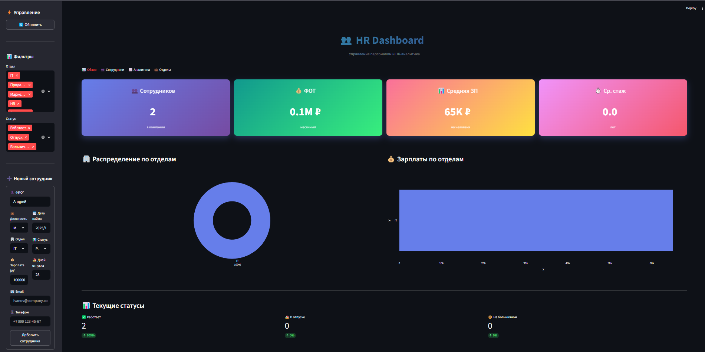
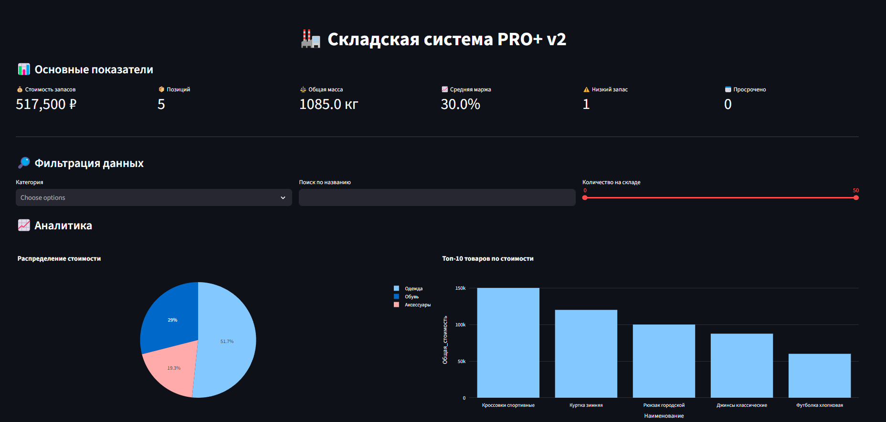
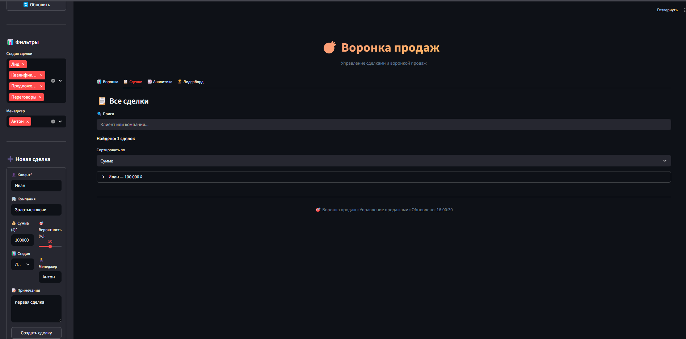

# 5 полноценных бизнес-приложений, каждое из которых решает реальную боль и может использоваться в продакшене уже завтра

## 1. CRM Dashboard — Обогащение баз контактов и контроль качества лидов

**CRM Dashboard для автоматизации поиска и обогащения клиентских контактов**  
**Streamlit + Google Sheets + gspread | Python**

Разработал полнофункциональное веб-приложение для управления базой телефонных контактов и контроля качества их обогащения данными (поиск ФИО владельца номера). Решение создано специально под задачу холодного обогащения баз в финансовом секторе (кредитование, страхование, инвестиционные продукты), где критически важна конверсия «номер → реальный человек».

### Ключевые возможности системы:
- Живое хранение данных в Google Sheets — несколько сотрудников работают с одной базой одновременно  
- Автоматическая инициализация демо-данных (7 найденных + 3 ненайденных)  
- Интерактивная аналитика в реальном времени: конверсия, соотношение найденных/ненайденных, топ ФИО  
- Цветовая индикация статуса (зелёный — найден, красный — не найден)  
- Удаление и добавление контактов в один клик с валидацией номера  
- Полнотекстовый поиск и фильтрация  

### Бизнес-ценность:
- Моментальная оценка качества входящих баз перед обзвоном  
- Снижение трудозатрат на ручной контроль Excel  
- Готовый инструмент для A/B-тестирования источников обогащения  

**Технологии:** Python • Streamlit • pandas • gspread • plotly • regex • Google Sheets API  
Готов к деплою за 2 минуты — без сервера, без Docker.

---

## 2. Финансовый Трекер — Личный и корпоративный учёт финансов

**Финансовый Трекер — дашборд с автоматической аналитикой и бюджетным планированием**  
**Streamlit + Google Sheets + Plotly | Python**

Полноценный финансовый менеджер, который заменяет Excel, «Дзен-мани», Тинькофф Журнал и корпоративные учётные системы.

### Что умеет:
- Три главные карточки: Доходы / Расходы / Баланс (с цветовой индикацией)  
- Круговая диаграмма расходов по категориям  
- График накопительного баланса день за днём  
- Умное бюджетное планирование с «спидометром» использования лимита  
- Прогноз: влезете ли в бюджет по средним тратам за 3 месяца  
- Добавление операций за 5 секунд  

### Бизнес- и личная ценность:
- Показывает, что аналитик умеет создавать продукт, которым пользуются каждый день  
- Глубокое понимание cash flow, структуры расходов и бюджетных правил  
- Идеальный кейс для финтеха и банков  

**Технологии:** Python • Streamlit • pandas • gspread • Plotly • Google Sheets API

---

## 3. HR Dashboard — Корпоративная аналитика персонала

**HR Dashboard — управление персоналом и расчёт ФОТ в реальном времени**  
**Streamlit + Google Sheets + Plotly | Python**

Заменяет Битрикс24, 1С ЗУП и Huntflow для малого и среднего бизнеса.

### Главные метрики:
- Количество сотрудников  
- Месячный ФОТ  
- Средняя зарплата  
- Средний стаж (индикатор текучести)  
- Распределение по отделам и статусам (работает / отпуск / больничный)  

### Функционал:
- Добавление сотрудника за 10 секунд  
- Автоматический расчёт остатка отпуска по ТК РФ  
- Зарплаты по отделам — сразу видно, где переплата/недоплата  
- Поиск и фильтры  

### Почему это сильный кейс для финансового аналитика:
- Персонал — одна из самых больших статей расходов  
- Показывает умение работать с затратами на персонал и строить управленческие дашборды  

**Технологии:** Python • Streamlit • pandas • gspread • Plotly

---

## 4. Складская система PRO+ v2 — Управление запасами и маржинальностью

**Складская система PRO+ v2 — мини-WMS с финансовой аналитикой**  
**Streamlit + Google Sheets + pandas + Plotly | Python**

Заменяет «МойСклад», 1С-Товары и Excel для малого ритейла и производства.

### Ключевые метрики:
- Стоимость остатков (517 500 ₽)  
- Общая масса товаров  
- Средняя наценка (30 %)  
- Низкий запас / просрочка — с цветовой индикацией  
- Ожидаемая прибыль при продаже  

### Аналитика:
- Распределение стоимости по категориям  
- Топ товаров, где «заморожены» деньги  
- Экспорт в CSV/Excel  

### Бизнес-ценность:
- Финансовый взгляд на склад: где лежат «мёртвые» деньги  
- Помогает принимать решения о закупках и распродажах  

**Технологии:** Python • Streamlit • pandas • gspread • Plotly

---

## 5. Воронка продаж — Лёгкая CRM с пайплайном и лидербордом

**Воронка продаж — управление сделками и прогноз выручки**  
**Streamlit + Google Sheets + Plotly | Python**

Идеальная CRM для B2B, агентств, девелоперов и всех, кто продаёт дорого.

### Главные метрики:
- Сделок в работе  
- Общий потенциал (сумма по пайплайну)  
- Средний чек  
- Win-rate  

### Функционал:
- Классическая воронка: Лид → Квалификация → Предложение → Переговоры → Закрыта  
- Добавление сделки за 10 секунд  
- Фильтры по менеджерам и стадиям  
- Лидерборд менеджеров  

### Бизнес-ценность:
- Прогнозирование выручки  
- Видно, где «зависают» деньги  
- Контроль эффективности продаж  

**Технологии:** Python • Streamlit • pandas • gspread • Plotly

---
